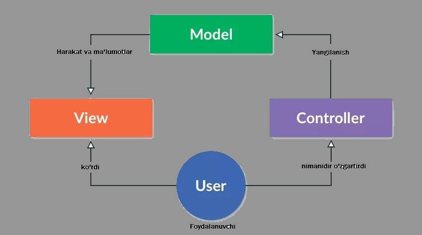
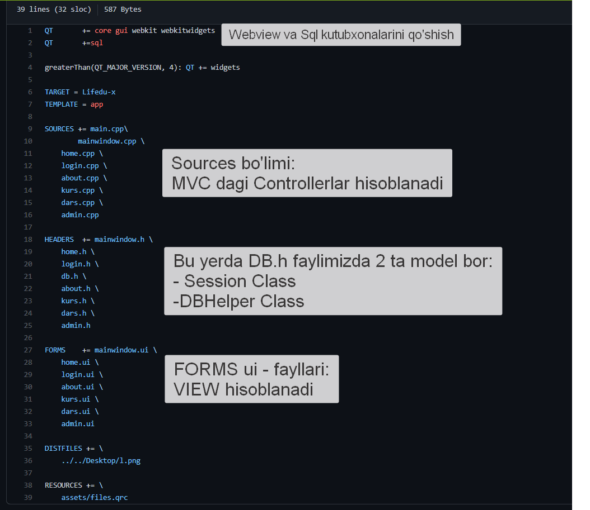
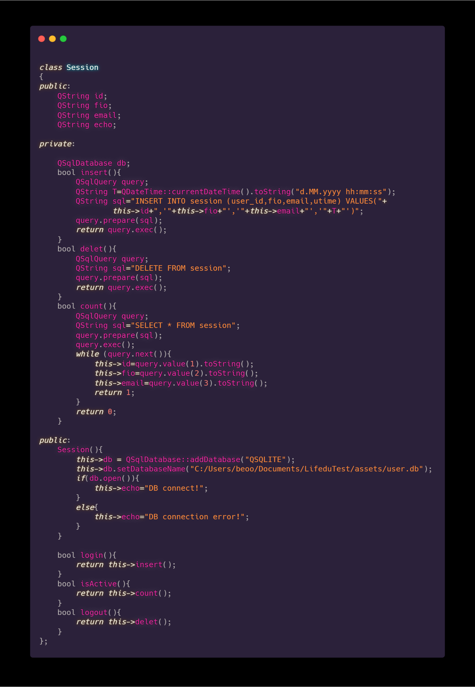
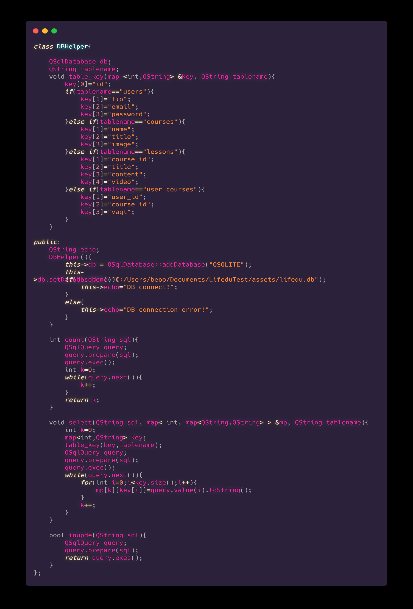
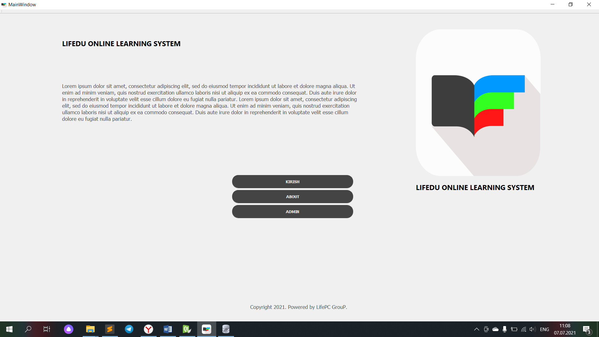
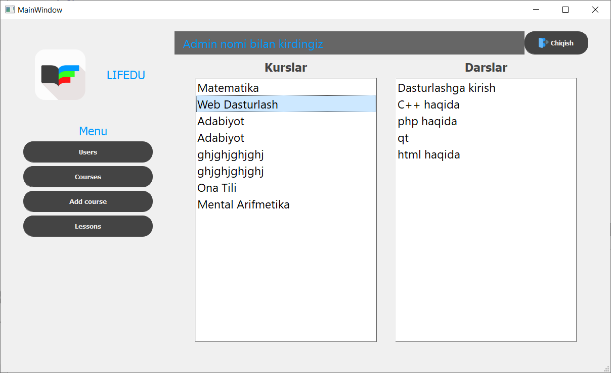
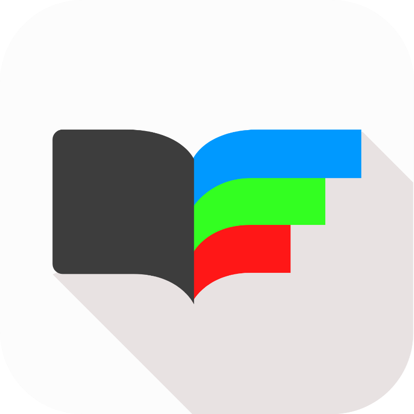

# qt-lifedu
Dasturlash asoslari fanidan "LIFEDU" mavzusidagi kurs ishi QT Creator muhitida tuzildi

**Reja:**

1. MVC – Model view controller  haqida
2. Loyihamiz tuzilmasi
3. Loyiha kodlari
4. Loyiha natijasi
5. Xulosa
6. Foydalanilgan adabiyotlar

1. **MVC – Model view controller  haqida**
## **Tarix**
Grafik foydalanuvchi interfeysini dastlabki ishlab chiqishda muhim tushunchalardan biri bo'lgan,MVC dasturiy ta'minot konstruksiyalarini ularning vazifalariga ko'ra amalga oshirish va ularni tavsiflashdagi ilk yondashuvlardan biri hisoblanadi.

Trygve Reenskaug, 1970-yil Xerox Palo Alto Tadqiqotlar Markazi(PARC)da SmallTalk-79 dasturlash tilida MVC'ni tanishtirdi. 1980-yillarda Jim Altthoff va boshqalar Smalltalk-80 klass kutubxonasi uchun MVC'ning birinchi versiyasini ishlab chiqishdi. Faqat keyinroq, 1988-yilda "The Journal of Object Technology"(Obyekt texnologiyalar jurnali) da MVC, umumiy konseptsiya sifatida maqola chop etildi.

MVC andozasi(ingliz tilida pattern, rus tilida шаблон) keyinchalik riovjlandi, shuningdek MVC'ni turli xil kontekstlarga moslashtiradigan iyerarxik model-view-controller(HMVC), model-view-adapter(MVA), model-view-presenter(MVP), model-view-viewmodel(MVVM) va boshqa  turli xil variantlari paydo bo'ldi.

## **MVC'dan foydalanishdan maqsad**
MVC, ilovaning turli xil komponentalarini ajratib ishlatishni talab qilgani uchun, dasturchilar bir-biriga halaqit yoki ishini bo'lib turmasdan, turli xil komponentlari ustida paralell ravishda ishlash qobiliyatiga ega bo'lishiadi. Masalan, bir jamoa o'zining dasturchilarini front-end va back-end qismlari uchun ma'sul qilib qo'yishlari mumkin. Back-end dasturchilar ma'lumot strukturasini tuzishsa va aksincha front-end dasturchilar ma'lumot strukturasi mavjud bo'lgandan keyingi ilovaning ko'rinishini tuzishlari mumkin bo'ladi.

## **Koddan qayta foydalanish mumkinligi**
MVC arxitekturasi tamoyillari qayta foydalanib bo'ladigan kod yozishni ta'minlaydi.

## **Afzalliklari**
- Bir vaqtni o'zida ishlab chiqish
- Bitta o'zgartirish butun ilovaga ta'sir qilmaydi
- Bitta model uchun bir va undan ortiq shablonlar(views)
- Katta o'lchamdagi veb-ilovalar uchun ideal tanlov
- Hamjihatlikda ishlash

## **1-rasm. MVC ishlash prinsipi**

### **1. Model**
Model - ilovadagi ma'lumotlarni boshqarishga ma'sul. U view'dan kelgan so'rovga hamda o'zini yangilash uchun controller'dagi ko'rsatmaga javob beradi.

### **2. View**
View - ilova ichida obyektlarni namoyish etishni anglatadi. Aniqroq aytadigan bo'lsak, u foydalanuvchi ko'radigan har qanday komponenta hisoblanadi. Oddiygina shablon deb ataymiz.

### **3. Controller**
Controller - ikkala model va views'dagi o'zgarishlarni yangilaydi. U kiritish(input) qabul qiladi va tegishli update(o'zgarish, yangilanish)ni bajaradi. Misol uchun, controller - view orqali kiritilgan ma'lumotni qabul qiladi va keyin model yordamida ma'lumotni qayta ishlab, yana qayta view'ga jo'natadi.

1. **Loyihamiz tuzilmasi**

**2**- **rasm. Loyiha tuzilmasi**

**Loyiha kodlari**

- Tizim uchun 2 ta model tuzilgan. Modellar db.h faylida saqlanadi:

[Db.h](https://github.com/EsanovOtabek/qt-lifedu/blob/main/db.h)

- Session Class – bu klassda dasturni ochgan foydalanuvchini local ma’lumotlari saqlanadigan baza bilan ishlaydi (3-rasm).
- DBHelper Class – bu klassda dasturning ma’lumotlar bazasi bilan ishlaydi (4-rasm). Ushbu class C++ dasturlash tilining

 STL (Standart Template Library) kutubxonasidagi <map> sinfining imkoniyatlaridan foydlanilgan

	

**3-rasm. Session sinfi**

4-rasm. DBHelper sinfi

- **.h kutubxona fayllar**

[about.h](https://github.com/EsanovOtabek/qt-lifedu/blob/main/about.h "about.h")  

[admin.h](https://github.com/EsanovOtabek/qt-lifedu/blob/main/admin.h "admin.h") 

[dars.h](https://github.com/EsanovOtabek/qt-lifedu/blob/main/dars.h "dars.h")

[db.h](https://github.com/EsanovOtabek/qt-lifedu/blob/main/db.h "db.h") 

[home.h](https://github.com/EsanovOtabek/qt-lifedu/blob/main/home.h "home.h")

[kurs.h](https://github.com/EsanovOtabek/qt-lifedu/blob/main/kurs.h "kurs.h")

[login.h](https://github.com/EsanovOtabek/qt-lifedu/blob/main/login.h "login.h")

[mainwindow.h](https://github.com/EsanovOtabek/qt-lifedu/blob/main/mainwindow.h "mainwindow.h") 

- **.cpp source files. Controllerlar**

[about.cpp](https://github.com/EsanovOtabek/qt-lifedu/blob/main/about.cpp)

[admin.cpp](https://github.com/EsanovOtabek/qt-lifedu/blob/main/admin.cpp)

[dars.cpp](https://github.com/EsanovOtabek/qt-lifedu/blob/main/dars.cpp)

[main.cpp](https://github.com/EsanovOtabek/qt-lifedu/blob/main/db.cpp)

[home.cpp](https://github.com/EsanovOtabek/qt-lifedu/blob/main/home.cpp)

[kurs.cpp](https://github.com/EsanovOtabek/qt-lifedu/blob/main/kurs.cpp)

[login.cpp](https://github.com/EsanovOtabek/qt-lifedu/blob/main/login.cpp)

[mainwindow.cpp](https://github.com/EsanovOtabek/qt-lifedu/blob/main/mainwindow.cpp)

- **.ui View files. VIEW – Ko’rinishlar**

[about.ui](https://github.com/EsanovOtabek/qt-lifedu/blob/main/about.ui)

[admin.ui](https://github.com/EsanovOtabek/qt-lifedu/blob/main/admin.ui)

[dars.ui](https://github.com/EsanovOtabek/qt-lifedu/blob/main/dars.ui)

[home.ui](https://github.com/EsanovOtabek/qt-lifedu/blob/main/home.ui)

[kurs.ui](https://github.com/EsanovOtabek/qt-lifedu/blob/main/kurs.ui)

[login.ui](https://github.com/EsanovOtabek/qt-lifedu/blob/main/login.ui)

[mainwindow.ui](https://github.com/EsanovOtabek/qt-lifedu/blob/main/mainwindow.ui) 

              _Loyiha natijasi_

5-rasm. Bosh sahifa

6-rasm. Login

7-rasm. Kurslar

8-rasm. Kursni olish.

9-rasm. Sinfxona

10-rasm. Darsni ustiga 2 marta bossa dars ochiladi.

11-rasm. About sahifasi. Buning uchun Webview ishlatilgan

12-rasm Admin uchun foydalanuvchilarni qo’shish qayta ishlash sahifasi.

Foydalanuvchini ustiga 2 marta bossa Foydananuvchini ma’lumotlarini ko’radi.

13-rasm. Admin – kurslarga yangi dars qo’shish sahifasi

14-rasm. Kurs qo’shish sahifasi

15-rasm. Admin – kurslar va ularning darslarini nazorat qilish bo’limi

16-rasm. Loyiha logotipi.

**Xulosa:**
**
`	`Ushbu kurs ishida QT creator muhiti, SqLite3 Ma’lumotlar bazasi va C++ dasturlash tilining imkoniyatlaridan foydalanib tayyorlandi. Bunda Ma’lumotlar bazasi va u bilan ishlashni tahlil qilib ko’rildi. Shuni aytish kerakki Loyihada MVC texnologiyasidan foydalanish tizimni yanada optimallashtirishga yordam beradi va tizimni ishlash yaxshi bo’ladi. C++ map(STL) imkoniyatlaridan foydalanib MB dagi ma’lumotlarni map bilan olib, u bilan qayta ishlandi. Sqlite3 MBning imkoniyatlaridan foydalanildi.

**Foydalanilgan adabiyotlar:**

- [**https://doc.qt.io]** 
- [**https://www.geeksforgeeks.org]** 
- [**https://tutorials.uz**]
